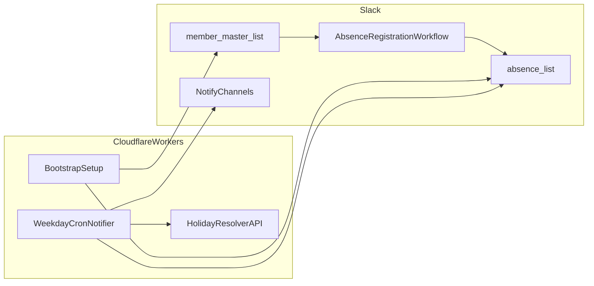

# pasr Slack不在通知 App

## 目的
- Slack List を入力台帳として利用し、不在通知運用を実現する。
- 入力UIは Slack、業務ロジックは Slack Platform/SDK + Cloudflare Workers に分離する。

## アーキテクチャ

## 境界（責務分離）
- Slack 側:
  - 入力 UI と台帳管理（List / Workflow）を担当する。
  - 不在データの登録起点を提供する。
- Cloudflare 側:
  - setup、定期実行、抽出判定、通知実行を担当する。
  - 失敗時はレコード単位で skip して処理継続する。
- データ境界:
  - `absence_list` は入力ソース・通知判定ソースとして扱う。
  - `member_master_list` は Phase 3 まで参照のみの概念として扱う。
- セキュリティ境界:
  - Token/Secret は Cloudflare Secrets のみで管理し、リポジトリに保存しない。

## Agents SDK 境界
- Cloudflare 側の実装基盤は `agents` を採用する前提とする。
- Workers のエントリ境界:
  - HTTP 入口は `routeAgentRequest` を優先し、非該当ルートのみ通常 `Response` を返す。
- 状態/実行境界:
  - 状態管理は Agent の `setState` と永続化機構を利用する。
  - 定期実行・遅延実行は Agent のスケジューリング API で扱う。
- 設定境界:
  - `wrangler` には Durable Object binding と migration を定義する。
  - 過去 migration は編集せず、新しい tag を追加する運用とする。
- TypeScript 境界:
  - `@callable` 互換性のため `experimentalDecorators` は有効化しない。

## Cloudflare ガードレール
- 仕様・制限・CLI オプションは固定知識で判断せず、Cloudflare 公式ドキュメントを都度確認する。
- Workers 設定は `wrangler.jsonc` を正本として管理する。
- `compatibility_date` は新規作成時点で最新寄りの値を採用し、定期更新を前提にする。
- `compatibility_flags` は `nodejs_compat` を基本有効化方針とする。
- binding 変更後は `wrangler types` を実行し、`Env` は手書きしない。
- Secret は `wrangler secret` 系で管理し、ソース・設定ファイル・コミットへ含めない。

## Workers Best Practices 境界
- request スコープの値をモジュールグローバル変数に保持しない。
- 非同期処理は `await` / `return` / `ctx.waitUntil()` のいずれかで明示的に扱う。
- 例外制御は明示的な `try/catch` を基本とし、障害調査可能なログを残す。
- セキュリティ用途の乱数は Web Crypto を使用し、`Math.random()` に依存しない。

## フェーズ計画
- **Phase 1（MVP）**
  - `absence_list` のみ運用
  - 平日 Cron 実行
  - `notify_channels` へのチャンネル投稿のみ
- **Phase 2（運用安定）**
  - ログ可観測性の強化（エラー分類、skip理由集計）
- **Phase 2.5（通知拡張）**
  - `notify_users` への DM 通知追加
- **Phase 3（入力体験）**
  - `member_master_list` の導入（既定通知先の管理）
  - 入力補助の強化（既定値適用、入力ミスの事前ガイド）
  - 外部カレンダー/祝日 API 判定の追加

## 受け入れ条件
- 平日定時に JST 基準で `start_date <= today <= end_date` のみが通知される。
- List 未作成環境でも setup 1回で初期化できる。
- 不在登録が `absence_list` の必要項目だけで成立する。
- `notify_channels` 未入力時は登録拒否、またはエラー通知される。
- `start_date > end_date` のレコードは通知されず、ログに記録される。

## 詳細実装の扱い
- 以下は後続タスクで定義する:
  - 通知のグルーピング仕様
  - API 呼び出し順序とエラーリカバリ
  - 再実行時の運用詳細

## Phase 1 実行手順
- 依存関係をインストールする:
  - `npm install`
- Cloudflare Secret を設定する:
  - `wrangler secret put SLACK_BOT_TOKEN`
  - `wrangler secret put SLACK_SIGNING_SECRET`
- 変数を設定する:
  - `wrangler.jsonc` の `vars.SLACK_ABSENCE_LIST_ID` を setup 後の list id に設定
  - 必要なら `vars.SLACK_LIST_ACCESS_USER_IDS` に共有先ユーザー ID をカンマ区切りで設定
- ローカル起動:
  - `npm run dev`
- setup 手動実行:
  - `curl http://localhost:8787/setup`
  - レスポンスの `accessGranted` が `true` なら user 共有まで完了
- daily 手動実行:
  - `curl http://localhost:8787/run-daily`
  - 週末でも強制実行する場合: `curl "http://localhost:8787/run-daily?force=true"`
- scheduled テスト:
  - `curl http://localhost:8787/__scheduled`

## ログと再実行方針
- ログは JSON 形式で出力し、`processed/sent/skipped/errors` を確認する。
- skip 理由（例: `missing_notify_channels`, `invalid_date_range`）を記録する。
- 同日再実行は再投稿を許可する（重複抑止なし）。
